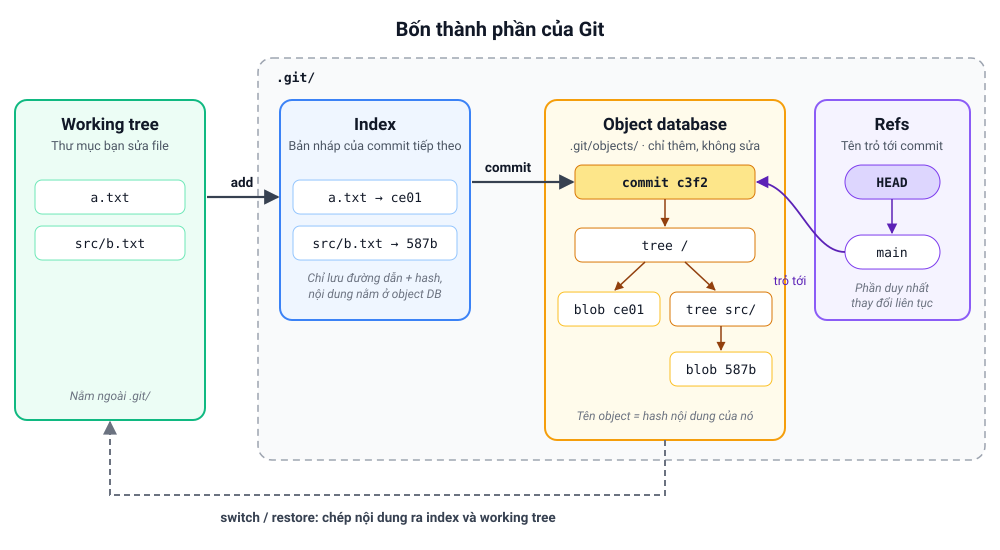

# Học Git bài bản: từ bên trong ra ngoài

Lộ trình này không bắt đầu bằng danh sách lệnh. Nó bắt đầu bằng câu hỏi **Git lưu dữ liệu như thế nào**. Khi đã hiểu Git thực chất chỉ là vài loại object, vài con trỏ và một file index, mọi lệnh (`add`, `commit`, `reset`, `merge`, `rebase`, `push`...) đều trở thành những thao tác đơn giản trên chính các thành phần đó. Lúc ấy bạn không cần học thuộc lệnh nữa, vì bạn **suy ra được** lệnh sẽ làm gì.

> 🗂️ Cần tra nhanh cú pháp? Xem [Cheat Sheet](cheat-sheet/README.md). Lộ trình này dùng để **hiểu**, cheat sheet dùng để **tra**.

## Mô hình tư duy xuyên suốt

Mọi bài học đều quay về hình này. Hãy nhớ nó trước khi bắt đầu:



- **Object database**: kho lưu nội dung. Object chỉ được thêm vào, không bao giờ bị sửa.
- **Refs**: tên dễ nhớ (branch, tag, `HEAD`) trỏ tới commit. Đây là phần **duy nhất** thay đổi liên tục.
- **Index**: bản nháp của commit tiếp theo.
- **Working tree**: thư mục bạn đang sửa file.

Câu hỏi cần tự đặt ra với **mọi lệnh**: *lệnh này thay đổi thành phần nào trong bốn thành phần trên?*

## Lộ trình

### Giai đoạn 1: Nền tảng bên trong (quan trọng nhất)

Đừng bỏ qua giai đoạn này. Đây là phần làm nên khác biệt giữa "dùng được Git" và "hiểu Git".

| # | Bài | Sau bài này bạn sẽ |
|---|-----|--------------------|
| 01 | [Git là gì: snapshot, phân tán, ba vùng](1-nen-tang/01-git-la-gi.md) | Có mô hình tư duy đúng ngay từ đầu, bỏ được các hiểu lầm phổ biến |
| 02 | [Object model: blob, tree, commit, tag](1-nen-tang/02-object-model.md) | Tự tạo commit **không cần `git commit`**, hiểu vì sao hash quyết định mọi thứ |
| 03 | [Refs, branch và HEAD](1-nen-tang/03-refs-branch-head.md) | Hiểu branch chỉ là file 41 byte, giải thích được detached HEAD |
| 04 | [Index và mô hình ba cây](1-nen-tang/04-index-ba-cay.md) | Đọc `git status` như đọc phép so sánh giữa ba cây |
| 05 | [Đồ thị commit và cú pháp revision](1-nen-tang/05-do-thi-commit.md) | Dùng thành thạo `~`, `^`, `..`, `...`, hiểu "reachable" |

### Giai đoạn 2: Thao tác hằng ngày, hiểu tận gốc

| # | Bài | Sau bài này bạn sẽ |
|---|-----|--------------------|
| 06 | [add, commit, status, diff](2-thao-tac-hang-ngay/06-add-commit-status-diff.md) | Biết chính xác mỗi lệnh ghi vào đâu, `diff` đang so cây nào với cây nào |
| 07 | [Branch, switch, checkout](2-thao-tac-hang-ngay/07-branch-switch-checkout.md) | Hiểu vì sao đôi khi Git từ chối chuyển nhánh và thay đổi chưa commit "đi theo" bạn |
| 08 | [Merge và xử lý conflict](2-thao-tac-hang-ngay/08-merge-va-conflict.md) | Hiểu fast-forward, three-way merge, merge base, conflict nằm ở đâu trong index |
| 09 | [Hoàn tác: restore, reset, revert, reflog](2-thao-tac-hang-ngay/09-hoan-tac.md) | Chọn đúng lệnh hoàn tác cho từng tình huống, cứu được commit "đã mất" |

### Giai đoạn 3: Cộng tác phân tán

| # | Bài | Sau bài này bạn sẽ |
|---|-----|--------------------|
| 10 | [Remote, fetch, pull, push](3-cong-tac/10-remote-fetch-push.md) | Hiểu remote-tracking branch, refspec, vì sao push bị từ chối |
| 11 | [Viết lại lịch sử: rebase, cherry-pick, amend](3-cong-tac/11-viet-lai-lich-su.md) | Hiểu rebase là "chép lại" commit, biết khi nào được và không được rewrite |
| 12 | [Quy trình làm việc nhóm](3-cong-tac/12-quy-trinh-nhom.md) | Chọn được merge hay rebase, trunk-based hay Git Flow, viết commit tốt |

### Giai đoạn 4: Nâng cao và vận hành

| # | Bài | Sau bài này bạn sẽ |
|---|-----|--------------------|
| 13 | [Stash và worktree](4-nang-cao/13-stash-worktree.md) | Biết stash thực chất là commit, làm song song nhiều nhánh bằng worktree |
| 14 | [Điều tra lịch sử: log, blame, pickaxe, bisect](4-nang-cao/14-dieu-tra-lich-su.md) | Tìm ra ai đổi gì, khi nào, và commit nào gây bug |
| 15 | [Lưu trữ: packfile, gc, reachability](4-nang-cao/15-luu-tru-va-gc.md) | Hiểu Git nén dữ liệu thế nào, khi nào dữ liệu thực sự bị xoá |
| 16 | [Cấu hình, ignore, attributes, hooks](4-nang-cao/16-cau-hinh-va-hooks.md) | Tuỳ biến Git theo dự án và tự động hoá bằng hook |
| 17 | [Tag, submodule, subtree](4-nang-cao/17-tag-submodule-subtree.md) | Quản lý phiên bản phát hành và phụ thuộc giữa các repo |

### Tổng kết

- [Bài tập tổng hợp](bai-tap-tong-hop.md): các tình huống thực tế, làm không cần xem lại bài.

## Cách học hiệu quả

1. **Học theo thứ tự.** Giai đoạn 1 là nền cho mọi thứ phía sau. Bài 02–04 có thể khó ở lần đọc đầu, nhưng đáng công nhất.
2. **Gõ lại mọi lệnh trong phần Thực hành.** Dùng một repo nháp, **đừng** thử trên repo thật:
   ```bash
   mkdir -p ~/git-lab && cd ~/git-lab
   rm -rf demo && git init demo && cd demo
   ```
3. **Luôn quan sát `.git/`.** Trước và sau mỗi lệnh, xem thứ gì thay đổi:
   ```bash
   git log --oneline --graph --all    # đồ thị commit
   git status                          # so sánh ba cây
   cat .git/HEAD                       # HEAD đang trỏ đâu
   git ls-files --stage                # nội dung index
   ```
4. **Trả lời phần "Tự kiểm tra"** trước khi mở đáp án. Nếu trả lời sai, đọc lại phần "Bên trong Git" của bài.
5. **Dùng cheat sheet như từ điển.** Mỗi bài có mục "Tra nhanh" trỏ sang phần tương ứng.

## Cấu trúc mỗi bài

| Phần | Nội dung |
|------|----------|
| 🎯 Mục tiêu | Những gì bạn làm được sau bài học |
| ❓ Vấn đề | Vì sao khái niệm này tồn tại |
| 🧠 Khái niệm | Định nghĩa và mô hình tư duy |
| 🔬 Bên trong Git | Lệnh thay đổi gì trong object, ref, index và working tree |
| 🧪 Thực hành | Chuỗi lệnh chạy được kèm output để quan sát |
| ⚠️ Hiểu lầm thường gặp | Những điều nhiều người nghĩ sai |
| ✅ Tự kiểm tra | Câu hỏi kèm đáp án ẩn |
| 🏋️ Bài tập | Bài tập tự làm |

## Yêu cầu

- Git ≥ 2.23 (để có `git switch` và `git restore`). Kiểm tra bằng `git --version`.
- Dùng được terminal cơ bản: `cd`, `ls`, `cat`, `echo`.

## Tài liệu tham khảo

- [Pro Git (bản miễn phí)](https://git-scm.com/book/en/v2), nhất là chương 10 *Git Internals*
- [Tài liệu chính thức](https://git-scm.com/docs): `git help <lệnh>`
- `git help glossary`: bảng thuật ngữ chính thức
- `git help revisions`: cú pháp chỉ định commit
